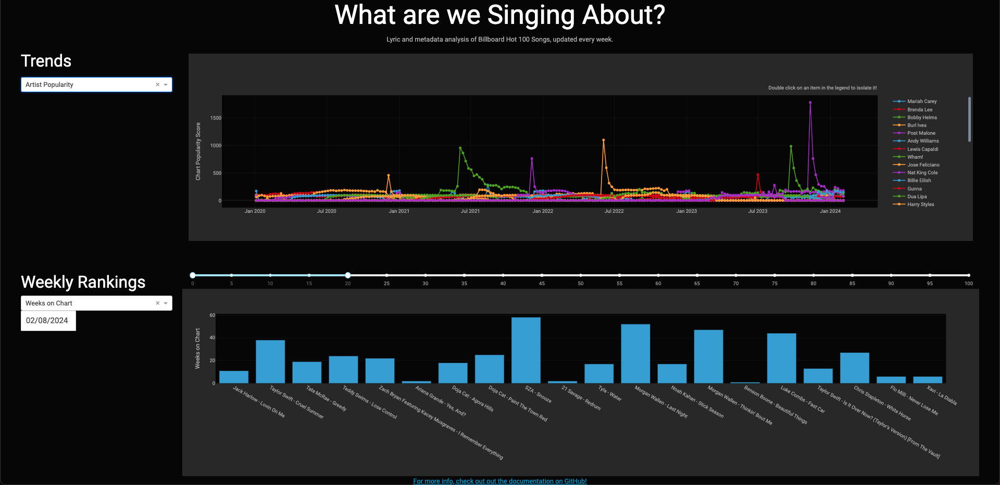
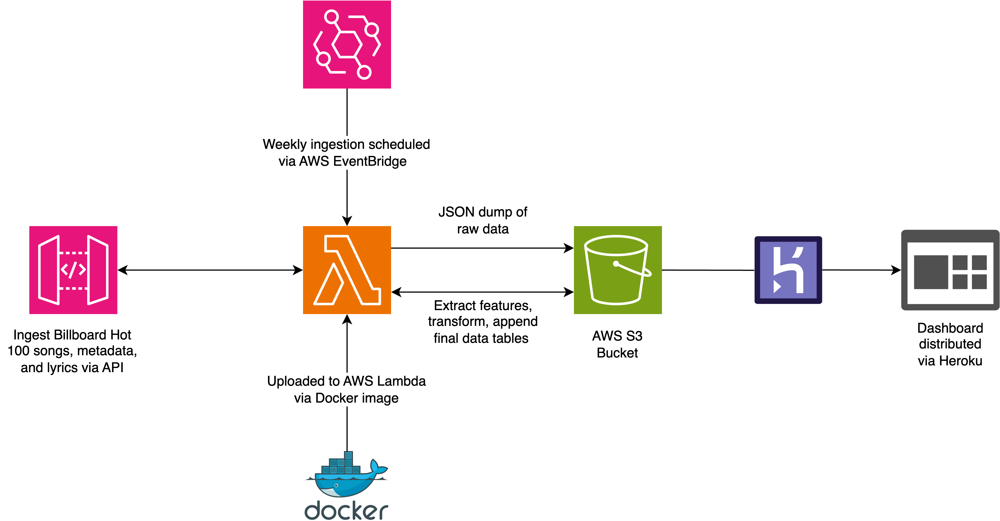

# What are we Singing About?
Lyric and metadata analysis of the current Billboard Hot 100 songs, updated weekly.

## The dashboard

[Check out the interactive dashboard here!](https://what-are-we-singing-about-d52172de0f31.herokuapp.com/)

## Architecture

## How it works

1. Inside of ``pull_data/lambda_function.py``, [this tool](https://github.com/mhollingshead/billboard-hot-100) is used to grab the current Billboard Hot 100 songs at runtime as JSON data. Then for each song the [Last.fm API](https://last.fm/api/intro) is used to grab track metadata and the [lyrist API](https://lyrist.vercel.app/guide) is used to grab lyrics. Finally, all of data is dumped into an AWS S3 Data Lake.

2. The contents of ``pull_data``, (including the necessary dependencies and ``secret_stuff.py``, which contains the Last.fm API key and is not included in this repo), are zipped and uploaded to AWS Lambda. The function is scheduled to run every Saturday by AWS EventBridge.

3. Inside of ``transform_data_package/image/src/lambda_function.py`` is code to process the data, including the lyrics. Briefly, the lyrics are cleaned, tokenized, and lemmatized, with stop words removed. For each week we provide the following weekly measurements:
    - Average word occurance frequencies.
    - Using the NRCLex package, which implements the NRC Word-Emotion Association Lexicon, we calculate average per-word frequencies for eight basic emotions and positive/negative sentiment.
    - Artist popularity scores, adding up to 100 points for each charting song they have that week.
    - Average song duration and weeks spent on chart with +/- 84% confidence intervals.
4. This code was uploaded to Lambda via Docker image and set to be triggered when a new json file is uploaded to the Data Lake. It extracts the measurements listed above and appends final data tables which are used for the Dashboard.
5. The Dashboard is distributed via Heroku.